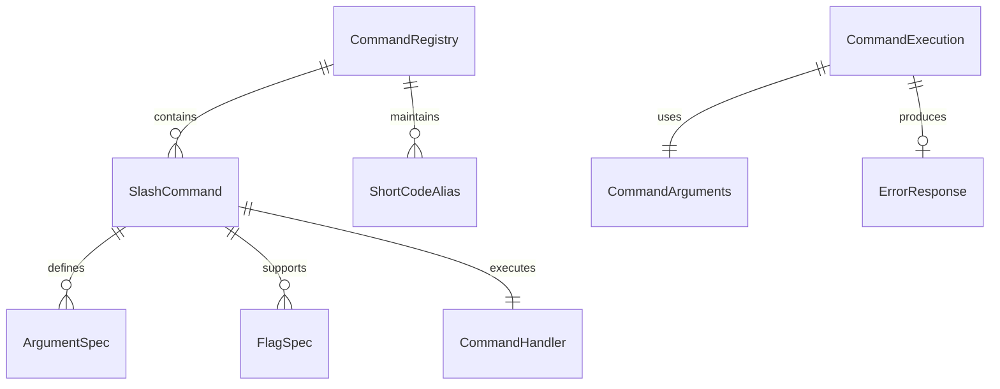

# Data Model: Slash Commands

**Feature**: 001-migrate-short-code
**Date**: 2025-09-26
**Version**: 1.0.0

## Entity Definitions

### SlashCommand
Represents a user-invokable command in Claude Code.

**Fields**:
- `name`: string (required)
  - Format: lowercase, alphanumeric with hyphens
  - Examples: "context", "plan", "retrospective"
  - Validation: Must start with letter, no spaces

- `description`: string (required)
  - Purpose: Displayed in auto-complete
  - Max length: 80 characters
  - Example: "Create a GitHub context issue and compact conversation"

- `handler`: function (required)
  - Signature: `(args: string[], flags: Flags) => Promise<void>`
  - Responsibilities: Execute command logic

- `arguments`: ArgumentSpec[] (optional)
  - Defines expected positional arguments
  - Example: Issue number for `/plan #123`

- `flags`: FlagSpec[] (optional)
  - Supported command flags
  - Standard: `--verbose`, `--dry-run`

**Relationships**:
- Registered in CommandRegistry (1:N)
- May reference ShortCodeAlias (1:1)

### CommandRegistry
Manages all available slash commands.

**Fields**:
- `commands`: Map<string, SlashCommand>
  - Key: command name
  - Value: SlashCommand instance

- `aliases`: Map<string, string>
  - Key: short code (e.g., "ccc")
  - Value: slash command name (e.g., "context")

**Methods**:
- `register(command: SlashCommand): void`
- `get(name: string): SlashCommand | undefined`
- `list(): SlashCommand[]`
- `resolveAlias(shortCode: string): string | undefined`

### CommandArguments
Parsed arguments from user input.

**Fields**:
- `positional`: string[]
  - Ordered list of positional arguments
  - Example: ["123"] for `/plan 123`

- `flags`: Flags
  - Parsed flag values
  - Example: { verbose: true, dryRun: false }

**Validation Rules**:
- Positional arguments must match expected count
- Unknown flags trigger warnings
- Required arguments must be present

### ErrorResponse
Structured error information for failed commands.

**Fields**:
- `code`: string (required)
  - Format: UPPER_SNAKE_CASE
  - Examples: "ERR_NO_GIT", "ERR_INVALID_ARGS"

- `message`: string (required)
  - User-friendly error description
  - Example: "Not in a git repository"

- `remedy`: string (required)
  - Actionable steps to resolve
  - Example: "Run 'git init' or navigate to a git repository"

- `context`: object (optional)
  - Additional error details
  - Example: { command: "plan", args: ["abc"] }

## State Transitions

### Command Execution Flow
```
IDLE → PARSING → VALIDATING → EXECUTING → COMPLETE
         ↓           ↓            ↓
       ERROR       ERROR        ERROR
```

**States**:
- `IDLE`: Awaiting user input
- `PARSING`: Processing command text
- `VALIDATING`: Checking arguments and flags
- `EXECUTING`: Running command logic
- `COMPLETE`: Successfully finished
- `ERROR`: Failed with ErrorResponse

**Transition Rules**:
1. IDLE → PARSING: User enters slash command
2. PARSING → VALIDATING: Command recognized
3. PARSING → ERROR: Unknown command
4. VALIDATING → EXECUTING: Arguments valid
5. VALIDATING → ERROR: Invalid arguments
6. EXECUTING → COMPLETE: Success
7. EXECUTING → ERROR: Runtime failure
8. COMPLETE/ERROR → IDLE: Ready for next command

## Relationships Diagram



## Data Constraints

### Uniqueness
- Command names must be unique within registry
- Short code aliases must be unique
- Flag names must be unique per command

### Required Fields
- Every SlashCommand must have name, description, handler
- Every ErrorResponse must have code, message, remedy
- Every command execution must validate arguments

### Validation Rules
1. Command names: lowercase, start with letter, alphanumeric + hyphens
2. Flag names: start with --, lowercase, alphanumeric + hyphens
3. Error codes: uppercase, alphanumeric + underscores
4. Descriptions: non-empty, max 80 characters

## Migration Mapping

| Short Code | Slash Command | Description |
|------------|---------------|-------------|
| `ccc` | `/context` | Create GitHub context issue and compact |
| `nnn` | `/plan` | Analyze issue and create implementation plan |
| `rrr` | `/retrospective` | Generate session retrospective |

## Extensibility Considerations

1. **Future Commands**: Registry pattern allows easy addition
2. **Custom Flags**: FlagSpec structure supports new flags
3. **Argument Types**: ArgumentSpec can be extended for typed arguments
4. **Error Categories**: Error codes follow naming convention for grouping
5. **Command Chaining**: State machine supports sequential execution

---
**Data Model Complete**: Ready for contract generation and testing.